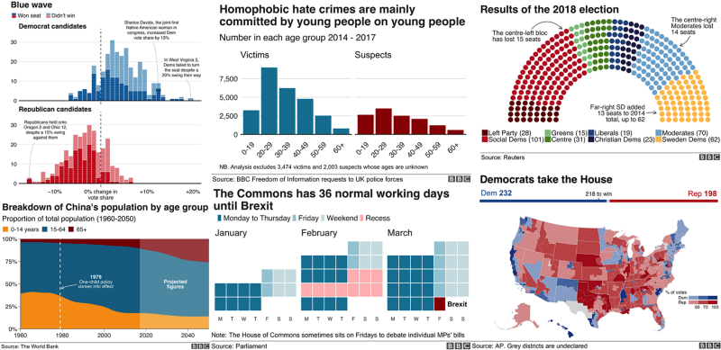

<div class="row">
  <div class="col-md-6">
  <h1>Online Articles</h1>
  <h3> How the BBC Visual and Data Journalism team works with graphics in R </h3>

  <a href="https://medium.com/bbc-visual-and-data-journalism/how-the-bbc-visual-and-data-journalism-team-works-with-graphics-in-r-ed0b35693535">
  
  
  
  </a>

  <h3>Why The R Programming Language Is Good For Business</h3>
  https://www.fastcompany.com/3030063/why-the-r-programming-language-is-good-for-business
  
  <h3>R vs Python for Data Science: The Winner is </h3>
  <a href="https://www.kdnuggets.com/2015/05/r-vs-python-data-science.html">
  
  
  </a>
  
  </div>
  
  
  

  
  
  
  <div class="col-md-6">
  
  <h1>ggplot2 Examples</h1>
  
  <h3>Scatter Plot with `midwest` Data Set (ggplot2)</h3>
  
```{r sp, warning=FALSE}

# load package and data
options(scipen=999)  # turn-off scientific notation like 1e+48
library(ggplot2)
theme_set(theme_bw())  # pre-set the bw theme.
data("midwest", package = "ggplot2")
# midwest <- read.csv("http://goo.gl/G1K41K")  # bkup data source

# Scatterplot
gg <- ggplot(midwest, aes(x=area, y=poptotal)) + 
  geom_point(aes(col=state, size=popdensity)) + 
  geom_smooth(method="loess", se=F) + 
  xlim(c(0, 0.1)) + 
  ylim(c(0, 500000)) + 
  labs(subtitle="Area Vs Population", 
       y="Population", 
       x="Area", 
       title="Scatterplot", 
       caption = "Source: midwest")

plot(gg)


```
  
  <h3>Marginal Histogram / Boxplot with `mpg` Data Set (ggplot2)</h3>
  
```{r mb, warning=FALSE}

# load package and data
library(ggplot2)
library(ggExtra)
data(mpg, package="ggplot2")
# mpg <- read.csv("http://goo.gl/uEeRGu")

# Scatterplot
theme_set(theme_bw())  # pre-set the bw theme.
mpg_select <- mpg[mpg$hwy >= 35 & mpg$cty > 27, ]
g <- ggplot(mpg, aes(cty, hwy)) + 
  geom_count() + 
  geom_smooth(method="lm", se=F)

ggMarginal(g, type = "histogram", fill="transparent")
ggMarginal(g, type = "boxplot", fill="transparent")
# ggMarginal(g, type = "density", fill="transparent")


```
  
<h3>Slope Chart</h3>
  
```{r slp}
  
library(ggplot2)
library(scales)
theme_set(theme_classic())

# prep data
df <- read.csv("https://raw.githubusercontent.com/selva86/datasets/master/gdppercap.csv")
colnames(df) <- c("continent", "1952", "1957")
left_label <- paste(df$continent, round(df$`1952`),sep=", ")
right_label <- paste(df$continent, round(df$`1957`),sep=", ")
df$class <- ifelse((df$`1957` - df$`1952`) < 0, "red", "green")

# Plot
p <- ggplot(df) + geom_segment(aes(x=1, xend=2, y=`1952`, yend=`1957`, col=class), size=.75, show.legend=F) + 
                  geom_vline(xintercept=1, linetype="dashed", size=.1) + 
                  geom_vline(xintercept=2, linetype="dashed", size=.1) +
                  scale_color_manual(labels = c("Up", "Down"), 
                                     values = c("green"="#00ba38", "red"="#f8766d")) +  # color of lines
                  labs(x="", y="Mean GdpPerCap") +  # Axis labels
                  xlim(.5, 2.5) + ylim(0,(1.1*(max(df$`1952`, df$`1957`))))  # X and Y axis limits

# Add texts
p <- p + geom_text(label=left_label, y=df$`1952`, x=rep(1, NROW(df)), hjust=1.1, size=3.5)
p <- p + geom_text(label=right_label, y=df$`1957`, x=rep(2, NROW(df)), hjust=-0.1, size=3.5)
p <- p + geom_text(label="Time 1", x=1, y=1.1*(max(df$`1952`, df$`1957`)), hjust=1.2, size=5)  # title
p <- p + geom_text(label="Time 2", x=2, y=1.1*(max(df$`1952`, df$`1957`)), hjust=-0.1, size=5)  # title

# Minify theme
p + theme(panel.background = element_blank(), 
           panel.grid = element_blank(),
           axis.ticks = element_blank(),
           axis.text.x = element_blank(),
           panel.border = element_blank(),
           plot.margin = unit(c(1,2,1,2), "cm"))  
  
  
```
  
  
  <h3>Dumbell Chart</h3>
  
```{r dc}

#devtools::install_github("hrbrmstr/ggalt")
library(ggplot2)
library(ggalt)
library(scales)
theme_set(theme_classic())

health <- read.csv("https://raw.githubusercontent.com/selva86/datasets/master/health.csv")
health$Area <- factor(health$Area, levels=as.character(health$Area))  # for right ordering of the dumbells

# health$Area <- factor(health$Area)
gg <- ggplot(health, aes(x=pct_2013, xend=pct_2014, y=Area, group=Area)) + 
        geom_dumbbell(color="#a3c4dc", 
                      size=0.75, 
                      colour_x = "darkred",
                      colour_xend = "darkBlue"
                      ) + 
        scale_x_continuous(label=percent) + 
        labs(x=NULL, 
             y=NULL, 
             title="Dumbbell Chart", 
             subtitle="Pct Change: 2013 vs 2014", 
             caption="Source: https://github.com/hrbrmstr/ggalt") +
        theme(plot.title = element_text(hjust=0.5, face="bold"),
              plot.background=element_rect(fill="#f7f7f7"),
              panel.background=element_rect(fill="#f7f7f7"),
              panel.grid.minor=element_blank(),
              panel.grid.major.y=element_blank(),
              panel.grid.major.x=element_line(),
              axis.ticks=element_blank(),
              legend.position="top",
              panel.border=element_blank())
plot(gg)


```
  
  
  
  </div>


</div>


