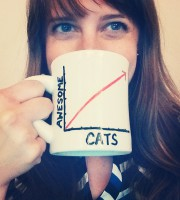
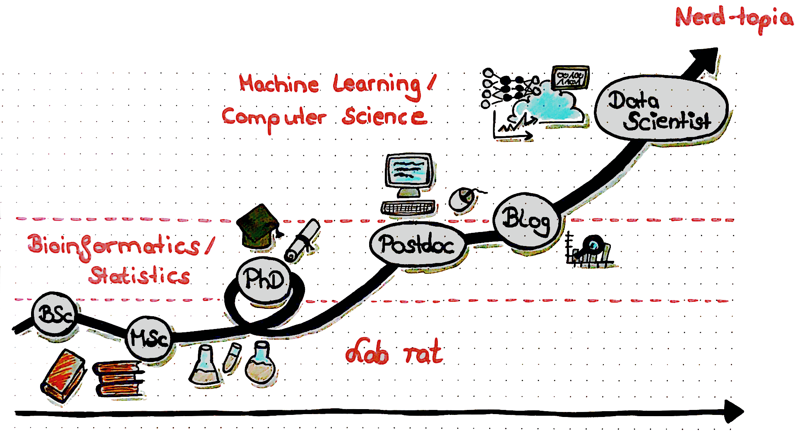

This page has links to lots of great R learning resources. You put in the time, you will be crushing it with R in no time!

<h1>Tutorials</h1>

https://www.rforcats.net

In R console type `help.start()`

http://cran.r-project.org/doc/manuals/r-release/R-intro.html

https://www.datacamp.com/courses/free-introduction-to-r

Just use Google!

<h1>SWIRL</h1>

The swirl() package has lots of hands on lessons that run right in your IDE.
`install.packages("swirl")`
Then fire it up and start practicing `library(swirl)` and `swirl()`.

<h1>R Blogs</h1>

Hadley Wickham

  <a href="https://www.r-bloggers.com">
  
  <a/>
  
  

 

  

 
Yihui's Blog!

  
Roger Peng

  
  

Hillary Parker

Shirin's Blog

